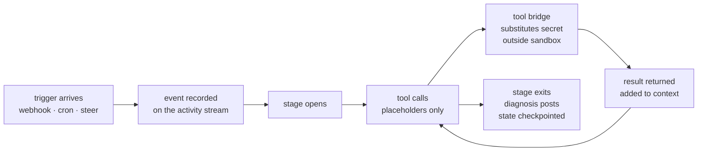

<Tip>
  This page introduces the operator-facing model. For the canonical technical reference — system topology, data flow, billing internals, security boundary, post-ship reflection — read [`docs/architecture/`](https://github.com/usezombie/usezombie/tree/main/docs/architecture) on GitHub.
</Tip>

## The four nouns

usezombie has four primary objects. Everything else is infrastructure.

<CardGroup cols={2}>
  <Card title="Tenant" icon="building">
    Your top-level billing and identity boundary. Created automatically on first Clerk sign-in. Carries your default Stripe customer — hosted execution is [free until July 31, 2026](https://usezombie.com/pricing).
  </Card>
  <Card title="Workspace" icon="folder-tree">
    A container for zombies and credentials. One tenant can have many workspaces (team, project, environment). Billing and identity live at the tenant — a workspace is purely an organizational boundary.
  </Card>
  <Card title="Zombie" icon="ghost">
    A persistent, durable agent process scoped to one operational outcome. One zombie has one `SKILL.md` + `TRIGGER.md`, a set of triggers (webhook, cron, steer), and a set of workspace credentials it uses but never sees raw bytes for. Lives inside a workspace; crashes and restarts are transparent — the platform survives them.
  </Card>
  <Card title="Tool" icon="plug">
    A named primitive the zombie's agent can invoke — `http_request`, `memory_store`, `cron_add`. Tools are declared in `TRIGGER.md` and **enforced** by the runner sandbox; the agent literally cannot call a tool that isn't on the list. The companion file `SKILL.md` is **advisory** — natural-language prose the model reads as its system prompt to decide *when* to reach for which tool and what counts as "done." Enforcement comes from `TRIGGER.md`; behavior comes from `SKILL.md`.
  </Card>
</CardGroup>

### How they relate

```
Tenant  (billing + identity, provider: anthropic)
│
├── Workspace: "platform-ops"
│   │
│   ├── Zombie: platform-ops      (zmb_2041)
│   │   ├── Tools:    http_request, memory_store, cron_add
│   │   └── Triggers: webhook (GitHub Actions), cron, steer
│   │
│   └── Credential: github        (workspace-scoped, shared)
│
└── Workspace: "support"
    │
    └── Zombie: ticket-triage     (zmb_2042)
        ├── Tools:    http_request, memory_store
        └── Triggers: webhook (Zendesk), steer
```

## Cost: free during the trial, bring your own model

Hosted execution — every event receipt and stage — is **free until July 31, 2026**. No credit card to start.

**You bring your provider and model.** Pick the provider (Anthropic, OpenAI, Fireworks, Together, Groq, Moonshot), attach the key, and pay them directly — usezombie marks up zero on inference. The runner resolves your credential at the tool bridge, so the agent never sees the raw key.

For the metered rates that apply after the trial, see [pricing on usezombie.com](https://usezombie.com/pricing).

## How a stage runs



A trigger lands on the event stream. A stage opens. The agent calls tools allow-listed by `TRIGGER.md`; each tool result lands in the model's context. The agent never sees raw secret bytes — placeholders substitute at the sandbox boundary. The stage exits when the agent is done or hits a [context boundary](/concepts/context-lifecycle); state checkpoints, the next trigger picks up.

## Core terminology

<AccordionGroup>
  <Accordion title="Stage">
    One end-to-end execution of the agent on one trigger: webhook arrives → agent reasons → tool calls → result. Most zombies finish a stage in a few seconds. See [How long does a stage take?](/concepts/context-lifecycle).
  </Accordion>

  <Accordion title="Trigger">
    What wakes a zombie. Three sources, all feeding the same reasoning loop:

    - **Webhook** — an external system (GitHub, Slack, your monitoring) POSTs to `https://api.usezombie.com/v1/webhooks/{zombie_id}/{source}` (one URL per declared trigger source).
    - **Cron** — the zombie schedules its own future stages via the `cron_add` tool.
    - **Steer** — a human invokes `zombiectl steer <zombie_id> "..."` for a manual stage.

    `SKILL.md` decides what to do based on the event payload.
  </Accordion>

  <Accordion title="Tool catalog">
    The named verbs an agent can invoke, declared in `TRIGGER.md`:
    - `http_request` — outbound HTTP. Slack posts, GitHub calls, your provider — all go through this.
    - `memory_store` / `memory_recall` / `memory_list` / `memory_forget` — durable cross-event learning. See [Memory](/memory).
    - `cron_add` / `cron_list` / `cron_remove` — schedule future stages.

    The agent can only call tools that are explicitly listed. A jailbroken agent cannot reach outside the list.
  </Accordion>

  <Accordion title="Tool bridge">
    The boundary between your secrets and the model. Credentials are stored encrypted in the workspace vault; the model itself only sees `${secrets.NAME.FIELD}` placeholders. When the agent invokes a tool, the **tool bridge** substitutes the real secret value outside the sandbox, makes the outbound call, and returns the response — never the secret. A prompt-injection attack recovers only the placeholder string. See [Workspace credentials](/zombies/credentials).
  </Accordion>

  <Accordion title="Budget">
    Dollar ceilings on hosted execution (the platform compute that runs your zombie — separate from your model provider's bill) declared in `TRIGGER.md`. `daily_dollars` caps spend over a rolling 24-hour window; `monthly_dollars` caps the calendar month. Hitting either ceiling stops new stages from opening. During the launch free trial (through July 31, 2026) hosted-execution stages are billed at **$0**, so a budget ceiling won't stop a zombie for trial usage — these caps apply to the metered rate after the trial (see [pricing](https://usezombie.com/pricing)). Inference is on your model provider's bill, not on your usezombie invoice — your provider's own caps apply there.
  </Accordion>
</AccordionGroup>
