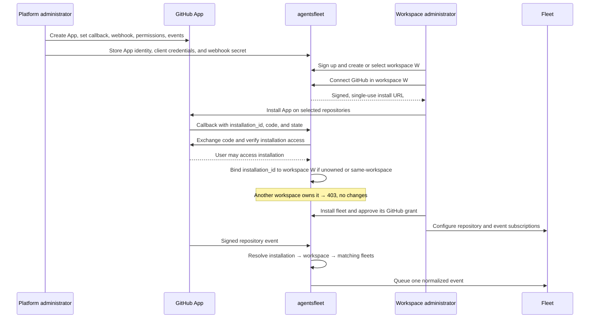
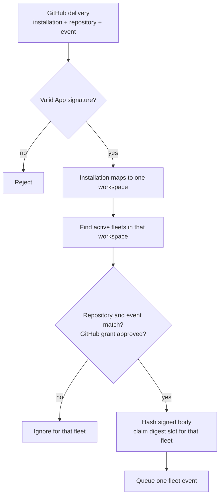

## Overview

A **connector** is how a workspace authorizes agentsfleet to act as a specific third-party account — your GitHub org, your Slack workspace, your Zoho Desk/Jira/Linear instance. The dashboard labels this surface **Integrations**; this guide uses "connector," the term the platform's own architecture docs use for the same thing.

Connectors are a different mechanism from [Secrets](/fleets/secrets). A secret is a static value you paste in yourself — a vendor API key referenced from `TRIGGER.md` as `${secrets.<name>.<field>}`. A connector is a live Open Authorization (OAuth) relationship: you click **Connect**, your browser leaves for the provider, and you come back with nothing to type in — the provider-issued token is vaulted server-side. If a provider only needs a pasted API key (no browser round-trip), it's a secret, not a connector.

## The connect round-trip

Every connector follows the same shape, regardless of provider:

<Steps>
  <Step title="Initiate">
    You click **Connect** on the dashboard's Integrations page. The platform mints a single-use, signed request and redirects your browser to the provider.
  </Step>
  <Step title="Authorize">
    You authorize on the provider's own site — GitHub, Slack, or the OAuth consent screen for Zoho/Jira/Linear.
  </Step>
  <Step title="Vault">
    The provider redirects back to agentsfleet with proof of the authorization. The platform verifies it, exchanges it for a real credential where the provider requires an exchange, and **vaults the token server-side** — it is never shown to you, never emailed, and never pasted into any form.
  </Step>
</Steps>

You never see or handle the raw token at any point. That's the whole point of a connector versus a hand-pasted secret: there's no string to leak, copy into the wrong Slack channel, or accidentally commit.

### The grant gate

Connecting a provider only proves the *workspace* is authorized — it does not automatically hand that credential to every fleet. A fleet must request access to a connected integration, and a human approves or denies the request from the dashboard as an **integration grant** before the fleet's runs can use the credential. Connect once per provider; grant per fleet.

## The five providers

agentsfleet ships five connectors. Four use OAuth 2.0 to obtain their runtime credential. GitHub uses a short authorization-code exchange only to prove the returning user may access the claimed App installation; runtime access still uses short-lived installation tokens minted from the App private key.

| Provider | Shape | Notes |
|----------|-------|-------|
| **GitHub** | App install + ownership proof | You install the agentsfleet GitHub App on your account or organisation. The callback carries `installation_id`, one-time `code`, and signed `state`; agentsfleet verifies installation access before saving the route. The broker later mints short-lived installation tokens from the App private key on demand. |
| **Slack** | OAuth 2.0 (no refresh) | Standard authorization-code exchange for a long-lived bot token — Slack doesn't issue a refresh token for this grant type, so there's nothing to refresh later. |
| **Zoho Desk** | OAuth 2.0 + refresh | Zoho is multi-region: the authorize step always starts at Zoho's US accounts server, but the callback tells the platform which data center actually issued the code (US, EU, India, Australia, China, Japan, or Canada), and every later token refresh must hit that same regional accounts server. |
| **Jira** | OAuth 2.0 + refresh | Atlassian's 3LO flow. The Jira **cloud id** for your site is *not* something you provide — it's resolved automatically from Atlassian's accessible-resources endpoint at callback time. |
| **Linear** | OAuth 2.0 + refresh | Standard authorization-code exchange with a refresh token. |

For the three refresh-token providers (Zoho, Jira, Linear), agentsfleet automatically re-mints a fresh access token from the stored refresh token as needed — you never have to reconnect just because a token expired. A refresh failing because you revoked access on the provider's side is the one case that does ask you to reconnect.

## GitHub App setup and event routing

The hosted deployment uses one GitHub App for every workspace. A platform administrator configures it once:

1. Set the callback URL to `https://api.agentsfleet.net/v1/connectors/github/callback`.
2. Enable **Request user authorization during installation** so the callback receives a one-time authorization code.
3. Set the webhook URL to `https://api.agentsfleet.net/v1/ingress/github` and keep the webhook active.
4. Grant **Metadata: Read-only** and **Pull requests: Read & write**. Add **Contents** or other permissions only when a fleet needs them.
5. Subscribe to **Pull request** and **Workflow run** events.
6. Store the App identifier, public slug, private key, webhook secret, client identifier, and client secret through the platform-admin setup flow. These values are never entered in a customer workspace.

The callback and webhook URLs have different jobs. The callback finishes a person's browser setup. The webhook URL receives signed machine events after setup.



### What a GitHub event is connected to

GitHub sends an installation identifier, a repository name, an event name, and a diagnostic delivery identifier. It does not know your `workspace_id`, `fleet_id`, or signed-in user.

agentsfleet derives those values in two steps:



The App installation defines the largest set of repositories GitHub will expose. Each fleet narrows that set in `TRIGGER.md`:

```yaml
triggers:
  - type: webhook
    source: github
    events: [pull_request]
    repositories: [acme/payments]
```

Two fleets may subscribe to the same repository and event. Each receives one event. A fleet with the wrong repository, the wrong event, no repository list, or no approved GitHub grant receives nothing.

The browser-provided installation identifier is never trusted alone. Signed state proves which `agentsfleet` workspace initiated the connection, GitHub user authorization proves access to the installation, and the datastore refuses to move an existing installation to another workspace. For events, the signature-covered request body supplies the replay identity; changing the unsigned delivery header cannot create a second event.

<Warning>
  The `github-pr-reviewer` repository walkthrough is not yet an end-to-end proof. Keep it in testing until a real repository-bound Pull Request reaches exactly one expected fleet, the fleet posts its review with a short-lived installation token, and replaying the same delivery creates no duplicate event or review.
</Warning>

### Inspect connector state from the command line

```bash
agentsfleet connector list
agentsfleet connector status github
```

Use `--workspace <id>` to inspect a workspace other than your active one. Use `--json` for automation. The state is one of `connected`, `not_connected`, `reconnect_required`, or `unconfigured`; the last state means the platform administrator has not configured that provider's App keys.

## Disconnecting

Revoking access on the provider's side (uninstalling the GitHub App, removing the Slack app from your workspace, revoking the OAuth grant in Zoho/Jira/Linear) invalidates the vaulted credential. The next run that needs it surfaces a reconnect prompt in the dashboard rather than failing silently.

## See also

- [Secrets](/fleets/secrets) — static vendor keys and model-provider credentials, the non-connector half of the vault.
- [Webhooks](/fleets/webhooks) — how external events reach a fleet once you're connected (or, for non-connector sources, once a secret is configured).
- [Error codes](/api-reference/error-codes) — the `UZ-CONN-*` and `UZ-SLK-*` codes a failed or misconfigured connector can return.
