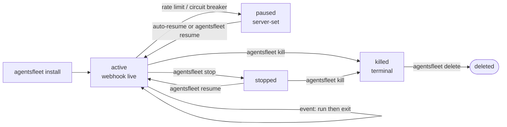

## Overview

A **fleet** is a preconfigured, always-on process in your workspace. You describe it once — its trigger, the tools it can use, the secrets it needs, the budget it is allowed to consume — and the platform keeps it alive, receiving events and invoking the fleet, until you kill it.

Everything in this section of the docs is about working with fleets: how to install one from the Fleet library, how to start and stop it, how to attach secrets, how webhooks reach it, and how to author the `SKILL.md` and `TRIGGER.md` files that define its behavior.

## Lifecycle

A fleet's `status` field reports one of four values — `active`, `paused`, `stopped`, `killed` — followed by a hard `delete` that removes the row entirely. `agentsfleet status` and the API print this value verbatim.



1. **`active`.** `agentsfleet install --library <id>` resolves a [library entry](/fleets/library) from your workspace gallery, fetches its `SKILL.md` + `TRIGGER.md`, creates the fleet in your workspace, provisions the webhook URL, and starts the event loop. Install is the deploy — there is no separate `up` step. While active, each signed event (webhook, cron, or steer) opens a **run**: the fleet reads the event, reasons, invokes the tools listed in `TRIGGER.md`, and produces a result. The activity stream is the durable record — replay with `agentsfleet logs <fleet_id>` (or `events --actor 'webhook:*'` for filtered history).
2. **`paused`.** The platform pauses a fleet on its own when it trips a guardrail (rate limit or circuit breaker). While paused it refuses new work — a steer or API call returns `UZ-AGT-012`, and a webhook gets `200 {"ignored":"fleet_paused"}` so upstream senders don't retry. It returns to `active` once the condition clears, and `agentsfleet resume` forces it back early. The CLI cannot *set* `paused` — it is server-only.
3. **`stopped`.** `agentsfleet stop <fleet_id>` halts the running session — new events stop dispatching, the in-flight run finishes cleanly. Reversible with `agentsfleet resume`. Use this for "pause while I debug upstream"; reach for `kill` only when you mean *terminal*.
4. **`killed`.** `agentsfleet kill <fleet_id>` marks the fleet terminal. The row, history, and webhook URL persist but no new events are processed. State is checkpointed; nothing on the event stream is lost. Re-installing with the same `SKILL.md` produces a **new** `fleet_id`.
5. **`delete`.** `agentsfleet delete <fleet_id>` hard-removes the fleet — you must `kill` it first. The row, its `fleet_id`, and its webhook URL are gone — the webhook URL starts returning `UZ-WH-001` for any new POSTs. The activity-stream history is retained for the workspace's retention window per [Observability](/cli/agentsfleet#observability); replays after delete reference the prior `fleet_id` as a historical record only.

You can inspect state at any time:

```bash
agentsfleet status                     # every fleet in the active workspace
agentsfleet logs 0198a7b2-9e1f-7c3a-8b25-6d4f0a9e2c71              # tail one fleet's recent activity
agentsfleet steer 0198a7b2-9e1f-7c3a-8b25-6d4f0a9e2c71 "morning health check"   # manual trigger
```

## Workspace scoping

Every fleet belongs to exactly one **workspace**. The workspace is the boundary for:

- **Secrets** — the vault that fleets read from when they invoke tools. See [Secrets](/fleets/secrets).
- **Access control** — teammates invited to a workspace can see, start, and kill its fleets; they cannot see fleets in other workspaces.
- **Webhook namespace** — every fleet in a workspace gets one unique URL per declared trigger under `https://api.agentsfleet.net/v1/webhooks/{fleet_id}/{source}` (one entry per `triggers[].source` in `TRIGGER.md`).

Billing is **not** workspace-scoped — every workspace draws on the same tenant-level billing. See [Billing](/billing/plans) for the model.

`agentsfleet workspace add [name]` creates a new workspace and sets it as active. Switch between existing ones with `agentsfleet workspace use <id>` (run `agentsfleet workspace list` first to see the IDs). The dashboard's active-workspace selection is independent — switching there does not affect the CLI and vice versa.

## What's next

<CardGroup cols={2}>
  <Card title="Run your first fleet" icon="circle-play" href="/quickstart">
    The guided five-minute path: install the `github-pr-reviewer` library entry and watch it react to a real pull request.
  </Card>
  <Card title="Install a fleet" icon="download" href="/fleets/install">
    Install a fleet from the Fleet library in your workspace gallery.
  </Card>
  <Card title="Start, stop, observe" icon="circle-play" href="/fleets/running">
    The `install`, `status`, `events`, `steer`, and `kill` commands.
  </Card>
  <Card title="Secrets" icon="key" href="/fleets/secrets">
    Add secrets to the vault without the fleet ever seeing them.
  </Card>
  <Card title="Authoring a fleet" icon="file-code" href="/fleets/authoring">
    How `SKILL.md` and `TRIGGER.md` combine to define a fleet.
  </Card>
</CardGroup>
