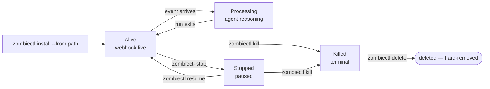

## Overview

An **agent** is a preconfigured, always-on agent process in your workspace. You describe it once — its trigger, the skills it can use, the credentials it needs, the budget it is allowed to consume — and the platform keeps it alive, receiving events and invoking the agent, until you kill it.

Everything in this section of the docs is about working with agents: how to install one from a template, how to start and stop it, how to attach credentials, how webhooks reach it, and how to author the `SKILL.md` and `TRIGGER.md` files that define its behavior.

## Lifecycle

An agent moves through five observable states.



1. **Alive.** `zombiectl install --from <path>` reads the local `SKILL.md` + `TRIGGER.md`, validates the schema, uploads to your workspace, provisions the webhook URL, and starts the event loop. Install is the deploy — there is no separate `up` step.
2. **Processing.** When a signed event arrives (webhook, cron, or steer), the platform opens a **run**: the agent reads the event, reasons, invokes the tools listed in `TRIGGER.md`, and produces a result. The activity stream is the durable record — replay any time with `zombiectl logs <zombie_id>` (or `events --actor 'webhook:*'` for filtered history).
3. **Stopped.** `zombiectl stop <zombie_id>` halts the running session — new events stop dispatching, the in-flight run finishes cleanly. Reversible with `zombiectl resume`. Use this for "pause while I debug upstream"; reach for `kill` only when you mean *terminal*.
4. **Killed.** `zombiectl kill <zombie_id>` marks the agent terminal. The row, history, and webhook URL persist but no new events are processed. State is checkpointed; nothing on the event stream is lost. Re-install with the same `SKILL.md` produces a **new** `zombie_id`.
5. **Deleted.** `zombiectl delete <zombie_id>` hard-removes the agent. The row, its `zombie_id`, and its webhook URL are gone — the webhook URL starts returning `UZ-WH-001` for any new POSTs. The activity-stream history is retained for the workspace's retention window per [Observability](/cli/zombiectl#observability); replays after delete reference the prior `zombie_id` as a historical record only. You must `kill` the agent before `delete` will accept it.

You can inspect state at any time:

```bash
zombiectl status                     # every agent in the active workspace
zombiectl logs zmb_2041              # tail one zombie's recent activity
zombiectl steer zmb_2041 "morning health check"   # manual trigger
```

## Workspace scoping

Every agent belongs to exactly one **workspace**. The workspace is the boundary for:

- **Credentials** — the vault that agents read from when they invoke skills. See [Credentials](/zombies/credentials).
- **Access control** — teammates invited to a workspace can see, start, and kill its agents; they cannot see agents in other workspaces.
- **Webhook namespace** — every agent in a workspace gets one unique URL per declared trigger under `https://api.usezombie.com/v1/webhooks/{zombie_id}/{source}` (one entry per `triggers[].source` in `TRIGGER.md`).

Billing is **not** workspace-scoped — every workspace draws on the same tenant-level billing. See [Billing](/billing/plans) for the model.

`zombiectl workspace add [name]` creates a new workspace and sets it as active. Switch between existing ones with `zombiectl workspace use <id>` (run `zombiectl workspace list` first to see the IDs). The dashboard's active-workspace selection is independent — switching there does not affect the CLI and vice versa.

## What's next

<CardGroup cols={2}>
  <Card title="Install an agent" icon="download" href="/zombies/install">
    Scaffold an agent from a bundled template.
  </Card>
  <Card title="Start, stop, observe" icon="circle-play" href="/zombies/running">
    The `install`, `status`, `events`, `steer`, and `kill` commands.
  </Card>
  <Card title="Workspace credentials" icon="key" href="/zombies/credentials">
    Add secrets to the vault without the agent ever seeing them.
  </Card>
  <Card title="Authoring an agent" icon="file-code" href="/zombies/authoring">
    How `SKILL.md` and `TRIGGER.md` combine to define an agent.
  </Card>
</CardGroup>
